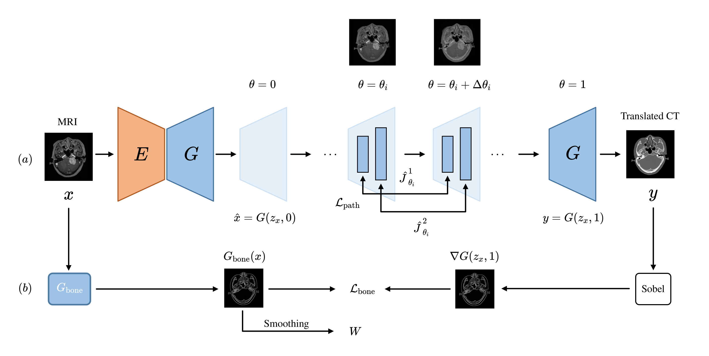

# 🧠🦴 PaBoT
Repository for the paper *"Path and Bone-Contour Regularized Unpaired MRI-to-CT Translation"*

---

## 📝 Abstract  
Accurate MRI-to-CT translation holds significant clinical value as it allows the integration of complementary imaging information without the need for additional imaging sessions. Given the practical challenges associated with acquiring paired MRI and CT scans, the development of robust methods capable of leveraging unpaired datasets is essential for advancing the MRI-to-CT translation. Current unpaired MRI-to-CT translation methods, which predominantly rely on cycle consistency and contrastive learning frameworks, frequently encounter challenges in accurately translating anatomical features that are highly discernible on CT but less distinguishable on MRI, such as bone structures. This limitation renders these approaches less suitable for applications in radiation therapy, where precise bone representation is essential for accurate treatment planning.  

To address this challenge, we propose a path- and bone-contour regularized approach for unpaired MRI-to-CT translation. In our method, MRI and CT images are projected to a shared latent space, where the MRI-to-CT mapping is modeled as a continuous flow governed by neural ordinary differential equations. The optimal mapping is obtained by minimizing the transition path length of the flow.  

To enhance the accuracy of translated bone structures, we introduce a trainable neural network to generate bone contours from MRI and implement mechanisms to directly and indirectly encourage the model to focus on bone contours and their adjacent regions.  

Evaluations conducted on three datasets demonstrate that our method outperforms existing unpaired MRI-to-CT translation approaches, achieving lower overall error rates. Moreover, in a downstream bone segmentation task, our approach exhibits superior performance in preserving the fidelity of bone structures.

<p align="center">
  
</p>

---

## 📂 Prepare dataset  
- [`unaligned_dataset.py`](data/unaligned_dataset.py) includes a dataset class that can load unaligned/unpaired datasets.  
It assumes that two directories host training images from domain A `/dataset/trainA` and from domain B `/dataset/trainB`, respectively.  
Similarly, you need to prepare directories `/dataset/testA` and `/dataset/testB` for testing, and `/dataset/valA` and `/dataset/valB` for validation.


---

## 🚀 Training & Testing

```bash
# Train the model
python train.py --dataroot=./datasets/Head --direction=BtoA --lambda_path=0.1 --tag=PaBoT

# Test the model
# Make sure to place the trained checkpoints in `checkpoints/Head`
Pretrained Models： [Head](https://drive.google.com/drive/folders/1O7Ke4BHM1PpnEV9WPhxqO39803tAuMiG?usp=drive_link)

python test.py --dataroot=./datasets/Head --name=Head --direction=BtoA --num_test 2250 --epoch 100
```


## 📌 Citation


If you find this work useful in your research or applications, please consider citing:

```bibtex
@article{zhou2025path,
  title={Path and Bone-Contour Regularized Unpaired MRI-to-CT Translation},
  author={Zhou, Teng and Luo, Jax and Sun, Yuping and Tan, Yiheng and Yao, Shun and Haouchine, Nazim and Raymond, Scott},
  journal={arXiv preprint arXiv:2505.03114},
  year={2025}
}
```


## 📚 References

This work is inspired by and builds upon the method proposed in:

```bibtex
@inproceedings{xie2023unpaired,
  title={Unpaired Image-to-Image Translation With Shortest Path Regularization},
  author={Xie, Shaoan and Xu, Yanwu and Gong, Mingming and Zhang, Kun},
  booktitle={Proceedings of the IEEE/CVF Conference on Computer Vision and Pattern Recognition},
  pages={10177--10187},
  year={2023}
}
